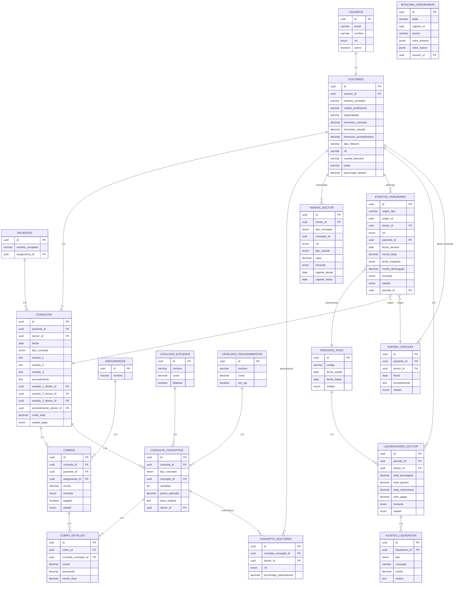
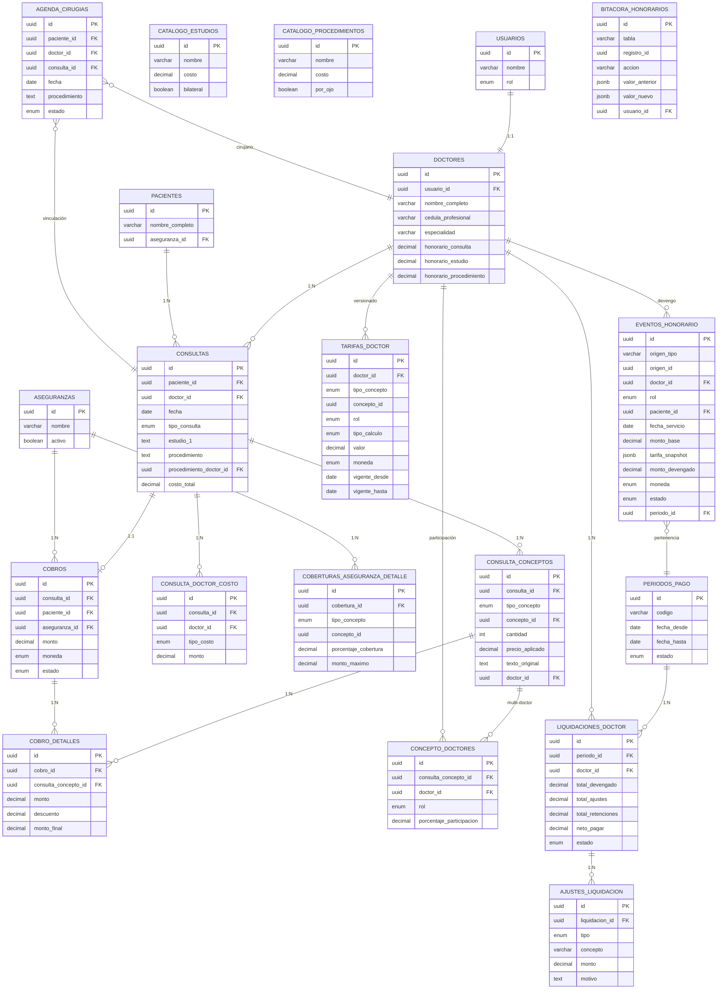

# Módulo de Honorarios y Productividad Médica — Fase 0: Análisis

## 1. Inventario Real del Repo

### 1.1 Hallazgo Crítico: Gap Arquitectónico

La documentación (`docs/ARCHITECTURE.md`, `docs/AI_CONTEXT.md`) describe una arquitectura de 5 capas con TypeORM:

```
Componente React → API Route → Service → Repository → TypeORM → Supabase → PostgreSQL
```

**La realidad es diferente:**

| Capa | Estado |
|------|--------|
| `src/entities/` | **Vacío** — 0 archivos |
| `src/services/` | **Vacío** — 0 archivos |
| `src/repositories/` | **Vacío** — 0 archivos |
| TypeORM dependency | **No instalado** — no aparece en `package.json` |
| TypeORM config | **No existe** — ni `ormconfig` ni `data-source` |
| Migraciones TypeORM | 5 archivos escritos pero **no ejecutables** sin TypeORM |

**Capa real de acceso a datos:**

```
Componente React → API Route → getSupabaseAdmin() → .from('tabla').select/insert/update
```

Toda la lógica de negocio vive directamente en los route handlers de `src/app/api/`.

### 1.2 Tablas Reales vs Documentadas

El `docs/ERD.md` documenta 10 tablas. La base de datos real tiene **al menos 17 tablas**:

| # | Tabla | En ERD | En Migraciones | En Código (API) | Columnas extra no documentadas |
|---|-------|--------|----------------|-----------------|-------------------------------|
| 1 | `usuarios` | ✅ | — | ✅ | `avatar_url` (migración SQL) |
| 2 | `doctores` | ✅ | — | ✅ | `honorario_consulta`, `honorario_estudio`, `honorario_procedimiento`, `created_at` |
| 3 | `pacientes` | ✅ | — | ✅ | `aseguranza_id`, `created_at` |
| 4 | `consultas` | ✅ | — | ✅ | `folio`, `costo_total`, `estado_pago`, `monto_pagado`, `fecha_pago`, `estudio_1_doctor_id`, `estudio_2_doctor_id`, `estudio_3_doctor_id`, `procedimiento_doctor_id`, `created_at` |
| 5 | `cobros` | ✅ | — | ✅ | `estado`, `notas`, `created_at` |
| 6 | `aseguranzas` | ✅ | — | ✅ | `activo`, `created_at` |
| 7 | `categorias_lentes` | ✅ | — | ✅ | — |
| 8 | `proveedores` | ✅ | — | ✅ | — |
| 9 | `lentes` | ✅ | — | ✅ | `folio` (migración), `created_at` |
| 10 | `lentes_x_consulta` | ✅ | — | ✅ | — |
| 11 | `notificaciones` | ❌ | ✅ | ✅ | — |
| 12 | `agenda_cirugias` | ❌ | ✅ | ✅ | — |
| 13 | `matriz_costos` | ❌ | ✅ | ✅ | — |
| 14 | `catalogo_estudios` | ❌ | ✅ | ✅ | — |
| 15 | `catalogo_procedimientos` | ❌ | ✅ | ✅ | — |
| 16 | `coberturas_aseguranza` | ❌ | ✅ | ✅ | — |
| 17 | `consulta_doctor_costo` | ❌ | ❌ | ✅ | **Sin migración** — referenciada en API |

### 1.3 Entidad: `agenda_cirugias` (NO está en ERD.md)

```sql
agenda_cirugias (
  id              UUID PK,
  paciente_id     UUID FK→pacientes (ON DELETE SET NULL),
  nombre_paciente TEXT NOT NULL,
  expediente      TEXT,
  fecha           DATE,
  hora            TIME,
  jornada         TEXT,
  diagnostico     TEXT,
  procedimiento   TEXT,        -- TEXTO LIBRE, sin catálogo
  ojo             TEXT,
  lio             TEXT,
  marca_lio       TEXT,
  tiempo_estimado TEXT,
  tiempo_estancia TEXT,
  doctor_id       UUID FK→doctores (ON DELETE SET NULL),
  estado          ENUM('agendada','aplazada','reagendada','completada','cancelada'),
  procedencia     TEXT,
  motivo_aplazamiento TEXT,
  notas           TEXT,
  notificado      BOOLEAN DEFAULT false,
  created_at      TIMESTAMPTZ,
  updated_at      TIMESTAMPTZ
)
```

**Estados:** `agendada` → `completada` | `cancelada` | `aplazada` → `reagendada`

**Observaciones:**
- `procedimiento` es **texto libre** (mismo problema que en `consultas`)
- Solo tiene **un doctor_id** (cirujano principal) — no hay multi-doctor
- No hay vínculo con la tabla `consultas`
- No hay relación con `catalogo_procedimientos`
- RLS: admin all, doctor own, recepcionista all

### 1.4 Entidad: `consulta_doctor_costo` (Sin migración)

Referenciada en `src/app/api/consultas/route.ts:275` y `src/app/api/cobros/doctor-costos/route.ts`:

```sql
consulta_doctor_costo (
  id          UUID PK (probable),
  consulta_id UUID FK→consultas,
  doctor_id   UUID FK→doctores,
  tipo_costo  ENUM('CONSULTA','ESTUDIO','PROCEDIMIENTO'),
  monto       DECIMAL(10,2),
  descripcion TEXT,
  created_at  TIMESTAMPTZ
)
```

**Esta tabla existe en la BD pero NO tiene migración formal.** Fue creada probablemente directamente en Supabase.

### 1.5 Entidad: `doctores` — Columnas No Documentadas

El ERD muestra 8 columnas. El código usa **12 columnas**:

| Columna | En ERD | En Código |
|---------|--------|-----------|
| `id` | ✅ | ✅ |
| `usuario_id` | ✅ | ✅ |
| `nombre_completo` | ✅ | ✅ |
| `cedula_profesional` | ✅ | ✅ |
| `especialidad` | ✅ | ✅ |
| `telefono` | ✅ | ✅ |
| `email` | ✅ | ✅ |
| `activo` | ✅ | ✅ |
| `honorario_consulta` | ❌ | ✅ — usado en UI y API |
| `honorario_estudio` | ❌ | ✅ — usado en UI y API |
| `honorario_procedimiento` | ❌ | ✅ — usado en UI y API |
| `created_at` | ❌ | ✅ — en SELECT de API |

### 1.6 Entidad: `consultas` — Columnas No Documentadas

| Columna | En ERD | En Código |
|---------|--------|-----------|
| `id` | ✅ | ✅ |
| `paciente_id` | ✅ | ✅ |
| `doctor_id` | ✅ | ✅ |
| `fecha` | ✅ | ✅ |
| `hora_inicio` | ✅ | ✅ |
| `hora_fin` | ✅ | ✅ |
| `tipo_consulta` | ✅ | ✅ |
| `tipo_visita` | ✅ | ✅ |
| `diagnostico` | ✅ | ✅ |
| `estudio_1` | ✅ | ✅ |
| `estudio_2` | ✅ | ✅ |
| `estudio_3` | ✅ | ✅ |
| `procedimiento` | ✅ | ✅ |
| `notas` | ✅ | ✅ |
| `folio` | ❌ | ✅ — generado como `CON-YY-NNNNN` |
| `costo_total` | ❌ | ✅ — calculado desde doctor_costos o matriz |
| `estado_pago` | ❌ | ✅ — `PENDIENTE` / `PAGADO` |
| `monto_pagado` | ❌ | ✅ |
| `fecha_pago` | ❌ | ✅ |
| `estudio_1_doctor_id` | ❌ | ✅ — FK→doctores |
| `estudio_2_doctor_id` | ❌ | ✅ — FK→doctores |
| `estudio_3_doctor_id` | ❌ | ✅ — FK→doctores |
| `procedimiento_doctor_id` | ❌ | ✅ — FK→doctores |
| `created_at` | ❌ | ✅ |

### 1.7 Entidad: `cobros` — Columnas No Documentadas

| Columna | En ERD | En Código |
|---------|--------|-----------|
| `id` | ✅ | ✅ |
| `consulta_id` | ✅ (NOT NULL) | ✅ (ahora NULLABLE por migración) |
| `paciente_id` | ✅ | ✅ |
| `aseguranza_id` | ✅ | ✅ |
| `metodo_pago` | ✅ | ✅ |
| `monto` | ✅ | ✅ |
| `moneda` | ✅ | ✅ |
| `pagado` | ✅ | ✅ |
| `fecha_pago` | ✅ | ✅ |
| `folio` | ✅ | ✅ |
| `estado` | ❌ | ✅ — `PAGADO` / `PENDIENTE` / `CANCELADO` |
| `notas` | ❌ | ✅ |
| `created_at` | ❌ | ✅ |

---

## 2. Mapa de Flujo: De la Agenda al Cobro

### 2.1 Flujo Actual (simplificado)

```
┌──────────────────┐
│  AGENDA CIRUGÍAS │  agenda_cirugias
│  (solo quirúrg.) │  doctor_id → un cirujano
└────────┬─────────┘
         │ (no hay vínculo formal)
         ▼
┌──────────────────┐
│    CONSULTA      │  consultas
│                  │  doctor_id → doctor principal
│  estudio_1/2/3   │  estudio_*_doctor_id → doctor por estudio
│  procedimiento   │  procedimiento_doctor_id → doctor proc.
│  costo_total     │
│  estado_pago     │
└────────┬─────────┘
         │
    ┌────┴────┐
    │         │
    ▼         ▼
┌────────┐ ┌──────────────────┐
│ COBRO  │ │ CONSULTA_DOCTOR  │
│        │ │ _COSTO           │
│ monto  │ │ doctor_id        │
│ único  │ │ tipo_costo       │
│        │ │ monto            │
└────────┘ └──────────────────┘
```

### 2.2 Dónde se Pierde la Trazabilidad al Doctor

| Punto de pérdida | Problema |
|------------------|----------|
| **Agenda → Consulta** | No hay FK entre `agenda_cirugias` y `consultas`. Una cirugía completada no se vincula automáticamente a su consulta. |
| **Estudios → Catálogo** | `estudio_1/2/3` son texto libre. No se puede JOINear con `catalogo_estudios`. El mismo estudio escrito distinto cuenta doble. |
| **Procedimiento → Catálogo** | `procedimiento` es texto libre. Idem anterior. |
| **Cobro → Conceptos** | `cobros.monto` es un monto único. No hay desglose de cuánto corresponde a consulta, cuánto a estudio, cuánto a procedimiento. |
| **Doctor en cirugía** | `agenda_cirugias` solo tiene un `doctor_id`. En cirugías con ayudante/anestesiólogo, solo se registra el cirujano principal. |
| **consulta_doctor_costo** | Existe pero no tiene migración formal. No se siembra automáticamente al crear la consulta. |

### 2.3 Flujo de Costos Actual

```
1. Crear consulta → se inserta en consultas con estudio_1/2/3 (texto)
2. Si se envían doctor_costos → se insertan en consulta_doctor_costo
3. costo_total = suma(doctor_costos.monto) o costo de matriz
4. Se crea cobro con monto único = costo_total
5. El cobro NO sabe cuánto es de cada concepto
6. Los doctor_costos NO se generan automáticamente
```

---

## 3. Matriz de Asociación Doctor–Concepto

| Entidad | ¿Cómo se liga al doctor? | ¿Multi-doctor? | Evento que dispara devengo | ¿Reversible? | ¿De dónde sale el monto base? |
|---------|--------------------------|----------------|---------------------------|---------------|-------------------------------|
| **Cita de agenda** (`agenda_cirugias`) | `doctor_id` (único, FK→doctores) | **No** — solo cirujano principal | Al marcar `completada` | Sí, pero sin reversión de honorarios (no existen) | No aplica — la agenda no tiene monto |
| **Consulta** (`consultas`) | `doctor_id` (FK→doctores) | **Parcial** — doctor principal + `estudio_*_doctor_id` + `procedimiento_doctor_id` | Al crear la consulta | No hay reversión automática | `matriz_costos.costo` por tipo+visita |
| **Estudio** (`consultas.estudio_1/2/3`) | `estudio_*_doctor_id` (columnas separadas) | **Sí, hasta 3** — un doctor por estudio, pero en columnas | Al crear la consulta | No | `catalogo_estudios.costo` (pero no se usa para el monto del cobro) |
| **Procedimiento** (`consultas.procedimiento`) | `procedimiento_doctor_id` | **No** — un solo doctor | Al crear la consulta | No | `catalogo_procedimientos.costo` (pero no se usa para el monto del cobro) |
| **Cirugía** (`agenda_cirugias`) | `doctor_id` (único) | **No** — solo cirujano | Al marcar `completada` | Sí, a través del estado | No hay monto asociado |
| **Cobro** (`cobros`) | A través de `consultas.doctor_id` | **No** — un monto único, sin desglose | Al pagarse | No automático | `consultas.costo_total` |
| **Costo por doctor** (`consulta_doctor_costo`) | `doctor_id` directo | **Sí** — un registro por doctor | Se inserta manualmente al crear consulta | No | Se define manualmente |

---

## 4. Estrategia de Migración: Texto Libre → Catálogo

### 4.1 Estado Actual

**Ya existen catálogos:**
- `catalogo_estudios` — 22 registros (OCT, campimetría, topografía, etc.)
- `catalogo_procedimientos` — 52 registros (facoemulsificación, vitrectomía, YAG, etc.)

**El problema:** Los campos `estudio_1/2/3` y `procedimiento` en `consultas` son **texto libre** que no referencian estos catálogos. El costo del cobro se calcula desde `matriz_costos` o `doctor_costos`, no desde los catálogos.

### 4.2 Estrategia Propuesta

**Fase 1: Tabla puente `consulta_conceptos`** (reemplaza funcionalmente a estudio_1/2/3):

```sql
consulta_conceptos (
  id              UUID PK,
  consulta_id     UUID FK→consultas,
  tipo_concepto   ENUM('ESTUDIO','PROCEDIMIENTO','CONSULTA'),
  concepto_id     UUID,  -- FK→catalogo_estudios o catalogo_procedimientos
  cantidad        INTEGER DEFAULT 1,
  precio_aplicado DECIMAL(10,2),
  texto_original  TEXT,  -- preserva el texto libre original
  doctor_id       UUID FK→doctores,  -- doctor que ejecutó este concepto
  created_at      TIMESTAMPTZ
)
```

### 4.3 Script de Backfill Idempotente

```sql
-- FASE: Backfill de consultas existentes a consulta_conceptos
-- Idempotente: usa ON CONFLICT para evitar duplicados

-- 1. Mapeo de aliases (tabla temporal de apoyo)
CREATE TEMP TABLE IF NOT EXISTS alias_estudios (
  texto_libre TEXT PRIMARY KEY,
  catalogo_id UUID REFERENCES catalogo_estudios(id)
);

-- Poblar con fuzzy match (ejecutar primero el script de matching)
-- Coincidencias exactas: lower(trim(texto)) = lower(trim(nombre))
-- Coincidencias por alias: tabla de sinónimos
-- No resueltas: reporte para revisión manual

-- 2. Backfill de estudios
INSERT INTO consulta_conceptos (consulta_id, tipo_concepto, concepto_id, texto_original, doctor_id)
SELECT
  c.id,
  'ESTUDIO',
  ae.catalogo_id,
  c.estudio_1,
  c.estudio_1_doctor_id
FROM consultas c
JOIN alias_estudios ae ON lower(trim(c.estudio_1)) = ae.texto_libre
WHERE c.estudio_1 IS NOT NULL
  AND NOT EXISTS (
    SELECT 1 FROM consulta_conceptos cc
    WHERE cc.consulta_id = c.id AND cc.tipo_concepto = 'ESTUDIO' AND cc.texto_original = c.estudio_1
  )
ON CONFLICT DO NOTHING;

-- (Repetir para estudio_2, estudio_3, procedimiento)

-- 3. Reporte de cobertura
SELECT
  'estudio_1' as campo,
  COUNT(*) as total,
  COUNT(cc.id) as migrados,
  COUNT(*) - COUNT(cc.id) as pendientes
FROM consultas c
LEFT JOIN consulta_conceptos cc ON cc.consulta_id = c.id AND cc.texto_original = c.estudio_1
WHERE c.estudio_1 IS NOT NULL;
```

### 4.4 Verificación de Cuadre

```sql
-- Verificar que Σ cobro_detalles.monto_final = cobros.monto
SELECT
  c.id as cobro_id,
  c.monto as monto_cobro,
  COALESCE(SUM(cd.monto_final), 0) as monto_detalles,
  c.monto - COALESCE(SUM(cd.monto_final), 0) as diferencia
FROM cobros c
LEFT JOIN cobro_detalles cd ON cd.cobro_id = c.id
GROUP BY c.id, c.monto
HAVING ABS(c.monto - COALESCE(SUM(cd.monto_final), 0)) > 0.01;
```

---

## 5. Supuestos y Preguntas Abiertas

### 5.1 Devengo

| # | Pregunta | Opciones | Recomendación |
|---|----------|----------|---------------|
| 1 | **¿Cuándo se devenga el honorario?** | A) Al ejecutar el servicio, B) Al cobrar, C) Al cerrar período | **A) Al ejecutar** — el doctor ya trabajó; el cobro es un evento financiero separado |
| 2 | **¿Qué evento dispara el devengo?** | Consulta creada, Agenda completada, Cobro pagado | **Consulta creada + Agenda completada** — depende del origen |
| 3 | **¿Se devenga por concepto o por consulta?** | Por concepto individual, Por consulta completa | **Por concepto** — permite métricas granulares |

### 5.2 Cancelaciones y No-Show

| # | Pregunta | Impacto |
|---|----------|---------|
| 4 | **¿Una consulta cancelada genera devengo?** | Si no → reversión automática. Si sí → monto parcial |
| 5 | **¿Un no-show genera devengo?** | Generalmente no, pero puede haber penalización |
| 6 | **¿La reversión de un cobro implica reversión del devengo?** | Sí si el devengo fue por cobro. No si fue por ejecución |

### 5.3 Doctor Externo y Referidor

| # | Pregunta | Impacto en diseño |
|---|----------|-------------------|
| 7 | **¿Hay doctores externos que no son usuarios del sistema?** | Si sí → necesitan registro mínimo en `doctores` sin `usuario_id` |
| 8 | **¿Se paga comisión por referidor?** | Si sí → el rol `REFERIDOR` en `concepto_doctores` ya lo soporta |

### 5.4 Retenciones

| # | Pregunta | Impacto |
|---|----------|---------|
| 9 | **¿Se calcula ISR sobre honorarios?** | Si sí → `retenciones` en liquidación |
| 10 | **¿Se cobra IVA sobre servicios médicos?** | Los servicios médicos generalmente están exentos en México |

### 5.5 Moneda

| # | Pregunta | Impacto |
|---|----------|---------|
| 11 | **¿Los honorarios pueden ser en DÓLARES?** | Ya existe `moneda` en cobros. Los doctores externos podrían cobrar en USD |
| 12 | **¿Se permite mezclar monedas en un período?** | Probablemente no → un período por moneda o conversión forzada |

### 5.6 Pago por Aseguranza vs Particular

| # | Pregunta | Impacto |
|---|----------|---------|
| 13 | **¿El honorario del doctor varía según la aseguranza?** | Si sí → `tarifas_doctor` necesita `aseguranza_id` opcional |
| 14 | **¿Qué porcentaje recibe el doctor en aseguranza vs particular?** | Definir regla o permitir configuración por tarifa |

---

## 6. Riesgos

### 6.1 Impacto en Datos Existentes

| Riesgo | Severidad | Mitigación |
|--------|-----------|------------|
| `consulta_doctor_costo` no tiene migración formal | Alta | Crear migración que documente la tabla antes de modificarla |
| `estudio_*_doctor_id` y `procedimiento_doctor_id` son FK implícitas (sin migración) | Alta | Verificar integridad referencial antes de la migración |
| `consultas.costo_total` se calcula inconsistentemente (a veces de `doctor_costos`, a veces de `matriz`) | Media | Normalizar antes de migrar |
| Datos históricos con `estudio_1/2/3` que no matchean catálogo | Media | Script de fuzzy match + reporte de no-resueltas |

### 6.2 RLS de Supabase

| Riesgo | Severidad | Mitigación |
|--------|-----------|------------|
| Las tablas nuevas necesitan RLS policies | Alta | Definir policies por rol antes de crear tablas |
| `consulta_doctor_costo` puede no tener RLS habilitado | Alta | Verificar y habilitar |
| El módulo honorarios necesita aislamiento por doctor | Media | RLS con `doctor_id = auth.uid()` para doctores |

### 6.3 Volumen y Performance

| Riesgo | Severidad | Mitigación |
|--------|-----------|------------|
| `eventos_honorario` crece rápido (1 fila por concepto por doctor) | Media | Indexar por `periodo_id`, `doctor_id`, `fecha_servicio` |
| Agregaciones para métricas sobre millones de filas | Media | Vista materializada si >100k eventos |
| Cierre de período con miles de eventos | Baja | Transacción + batch processing |

### 6.4 Concurrencia

| Riesgo | Severidad | Mitigación |
|--------|-----------|------------|
| Dos usuarios cierran el mismo período | Baja | `SELECT ... FOR UPDATE` o advisory lock |
| Devengo duplicado al reejecutar | Media | UNIQUE constraint en `(origen_tipo, origen_id, doctor_id, rol)` |

### 6.5 Datos Históricos

| Riesgo | Severidad | Mitigación |
|--------|-----------|------------|
| No se puede calcular honorarios históricos sin tarifas pasadas | Alta | `tarifa_snapshot` (JSONB) en `eventos_honorario` congela la tarifa |
| Cobros históricos sin desglose | Media | No intentar migrar cobros antiguos a `cobro_detalles` |

---

## 7. ERD en Mermaid — Nuevas Entidades + Relaciones



### Diagrama de Relaciones Clave

```
                        ┌─────────────────┐
                        │   CONSULTA      │
                        │                 │
                        │  doctor_id ─────┼──────► DOCTORES
                        │  estudio_1      │        (honorario_consulta,
                        │  estudio_2      │         honorario_estudio,
                        │  estudio_3      │         honorario_procedimiento)
                        │  procedimiento  │
                        └────────┬────────┘
                                 │
                    ┌────────────┼────────────┐
                    ▼            ▼            ▼
            ┌──────────┐ ┌──────────┐ ┌──────────┐
            │CONCEPTO  │ │CONCEPTO  │ │CONCEPTO  │
            │ESTUDIO 1 │ │ESTUDIO 2 │ │PROCEDIM. │
            │doctor_id │ │doctor_id │ │doctor_id │
            └────┬─────┘ └────┬─────┘ └────┬─────┘
                 │            │            │
                 ▼            ▼            ▼
            ┌──────────────────────────────────┐
            │      CONCEPTO_DOCTORES           │
            │  (rol: PRINCIPAL|AYUDANTE|...)   │
            │  (porcentaje_participacion)      │
            └──────────────┬───────────────────┘
                           │
                           ▼
            ┌──────────────────────────────────┐
            │      EVENTOS_HONORARIO           │
            │  origen_tipo + origen_id         │
            │  doctor_id + rol                 │
            │  monto_base                      │
            │  tarifa_snapshot (JSONB)         │
            │  monto_devengado                 │
            │  estado: PENDIENTE→DEVENGADO     │
            │         →LIQUIDADO               │
            └──────────────┬───────────────────┘
                           │
                           ▼
            ┌──────────────────────────────────┐
            │      PERIODOS_PAGO               │
            │  codigo: 2026-09-Q1              │
            │  estado: ABIERTO→CERRADO→PAGADO  │
            └──────────────┬───────────────────┘
                           │
                           ▼
            ┌──────────────────────────────────┐
            │   LIQUIDACIONES_DOCTOR           │
            │   neto_pagar                     │
            │   ┌─────────────────────┐        │
            │   │ AJUSTES_LIQUIDACION │        │
            │   │ (bonos, descuentos) │        │
            │   └─────────────────────┘        │
            └──────────────────────────────────┘
```

---

## 8. Resumen de Descubrimientos Críticos

### Lo que YA existe (no reinventar):

1. **`catalogo_estudios`** — 22 estudios oftalmológicos con precios
2. **`catalogo_procedimientos`** — 52 procedimientos con precios
3. **`matriz_costos`** — costos base por tipo_consulta × tipo_visita
4. **`coberturas_aseguranza`** — porcentaje de cobertura por aseguranza
5. **`consulta_doctor_costo`** — distribución de costos por doctor (sin migración formal)
6. **`honorario_consulta/estudio/procedimiento`** en `doctores` — tarifa base por doctor
7. **`estudio_*_doctor_id`** y **`procedimiento_doctor_id`** en `consultas` — asociación doctor-concepto
8. **API de cálculo de costos** (`/api/calcular-costo`) — desglose estudios + procedimientos + cobertura
9. **API de doctor-costos** (`/api/cobros/doctor-costos`) — distribución de costos por doctor

### Lo que NO existe (hay que crear):

1. **`consulta_conceptos`** — tabla puente normalizada (reemplaza estudio_1/2/3)
2. **`cobro_detalles`** — desglose del cobro por concepto
3. **`concepto_doctores`** — participación multi-doctor con roles
4. **`tarifas_doctor`** — tarifas versionadas por vigencia
5. **`eventos_honorario`** — tabla central de devengo
6. **`periodos_pago`** — gestión de períodos de liquidación
7. **`liquidaciones_doctor`** — liquidaciones de pago
8. **`ajustes_liquidacion`** — bonos, descuentos, anticipos
9. **`bitacora_honorarios`** — auditoría
10. **Motor de devengo** — servicio que genera eventos_honorario
11. **Métricas y reportes** — dashboard por doctor
12. **RLS policies** — aislamiento por rol

### Lo que hay que ARREGLAR primero:

1. **Migración formal de `consulta_doctor_costo`** — existe pero sin migración
2. **Migración formal de columnas adicionales** en `consultas`, `doctores`, `cobros`
3. **ERD.md está desactualizado** — documenta 10 tablas, la BD tiene 17+
4. **Flujo de costos inconsistente** — `costo_total` se calcula de distintas fuentes

---

## 9. Decisiones de Negocio (Fase 0 — Respondidas)

### 9.1 Devengo: Al Ejecutar, No al Cobrar

**Decisión:** El `eventos_honorario` se genera al **momento de ejecutar el servicio**, no al cobrar.

**Justificación:**
- El `src/app/api/consultas/route.ts:232` crea la consulta y el cobro en la misma transacción, pero son eventos independientes
- El cobro puede ser diferido (`estado_pago: PENDIENTE`) mientras el doctor ya trabajó
- `consulta_doctor_costo` se inserta al crear la consulta (L265-281), no al pagar
- El flujo real es: Consulta creada → doctor ejecuta → cobro se crea (puede ser después)

**Trigger por tipo de origen:**

| Origen | Evento trigger | Momento |
|--------|---------------|---------|
| Consulta | `INSERT` en `consultas` | Al crear la consulta |
| Estudio | `INSERT` en `consulta_conceptos` con tipo ESTUDIO | Al asignar estudio a consulta |
| Procedimiento | `INSERT` en `consulta_conceptos` con tipo PROCEDIMIENTO | Al asignar procedimiento |
| Cirugía (agenda) | `UPDATE agenda_cirugias SET estado = 'completada'` | Al marcar como completada |

**Regla de idempotencia:** UNIQUE constraint en `(origen_tipo, origen_id, doctor_id, rol)`. Reintentar no duplica.

### 9.2 Consulta Doctor Costo: Se Mantiene y Se Migra

**Decisión:** `consulta_doctor_costo` se **conserva como fuente de verdad histórica** y se migra formalmente con su migración. La nueva tabla `concepto_doctores` la reemplaza funcionalmente para el módulo nuevo.

**Justificación:**
- La tabla ya existe en la BD y tiene datos reales
- La API `/api/cobros/doctor-costos` la usa activamente (GET/POST)
- El frontend en `consultas/nueva/page.tsx` la consume
- No se puede eliminar sin romper el flujo actual

**Plan:**
1. Crear migración formal para `consulta_doctor_costo` (documentar la tabla)
2. `concepto_doctores` sera la tabla nueva para el módulo honorarios
3. El `MotorDevengoService` leerá de `consulta_doctor_costo` para historial y de `concepto_doctores` para nuevos registros

### 9.3 Honorarios en Doctores: Se Migran a Tarifas Versionadas

**Decisión:** Los campos `honorario_consulta/estudio/procedimiento` en `doctores` se **usan como fuente para sembrar `tarifas_doctor`** con `vigente_desde = '2020-01-01'` y `vigente_hasta = NULL` (vigente). Los campos originales se deprecan pero no se eliminan.

**Justificación:**
- El frontend ya los usa: `consultas/nueva/page.tsx:42-44` y `cobros/page.tsx:69-71`
- La API de configuración de doctores los lee y escribe (`/api/configuracion/doctores`)
- Cambiar una tarifa hoy altera el historial → por eso necesitamos `tarifas_doctor` versionada
- Los campos en `doctores` se mantienen para retrocompatibilidad

**Script de migración inicial:**
```sql
INSERT INTO tarifas_doctor (doctor_id, tipo_concepto, rol, tipo_calculo, valor, moneda, vigente_desde)
SELECT id, 'CONSULTA', 'PRINCIPAL', 'FIJO', honorario_consulta, 'PESOS', '2020-01-01'
FROM doctores WHERE honorario_consulta > 0;
-- Repetir para honorario_estudio, honorario_procedimiento
```

### 9.4 Cirugías: Vinculación Semi-Automática con Consultas

**Decisión:** Al importar o completar una cirugía, el sistema **busca consultas existentes** por nombre de paciente + procedimiento + rango de fecha. Si encuentra coincidencia, **pregunta si desea vincular**. Si no encuentra, ofrece crear una consulta nueva.

**Justificación:**
- El flujo actual (`agenda/import/route.ts`) ya hace matching de doctores por nombre fuzzy
- `agenda_cirugias` y `consultas` son tablas separadas sin FK
- En la práctica clínica: primero se agenda la cirugía, luego se registra la consulta
- La consulta puede existir antes o después de la cirugía

**Flujo de vinculación:**

```
┌─────────────────────────┐
│ Importar/Crear Cirugía  │
│ (agenda_cirugias)       │
└───────────┬─────────────┘
            │
            ▼
┌─────────────────────────┐
│ Buscar consulta:        │
│ - paciente_id matching  │
│ - procedimiento similar │
│ - fecha ± 30 días       │
└───────────┬─────────────┘
            │
     ┌──────┴──────┐
     │             │
  0 matches    1+ matches
     │             │
     ▼             ▼
┌──────────┐ ┌────────────────────┐
│ Ofrecer  │ │ Mostrar candidatos │
│ crear    │ │ Preguntar:         │
│ consulta │ │ "¿Vincular?"       │
│ nueva    │ │                    │
└──────────┘ └────────┬───────────┘
                      │
                ┌─────┴─────┐
                │           │
             Sí          No
                │           │
                ▼           ▼
        ┌──────────┐ ┌──────────┐
        │ SET      │ │ Crear    │
        │ consulta_│ │ consulta │
        │ cirugia_ │ │ nueva    │
        │ id       │ │          │
        └──────────┘ └──────────┘
```

**Nueva columna en `agenda_cirugias`:**
```sql
ALTER TABLE agenda_cirugias
  ADD COLUMN consulta_id UUID REFERENCES consultas(id) ON DELETE SET NULL;
CREATE INDEX idx_agenda_cirugias_consulta_id ON agenda_cirugias(consulta_id);
```

**API de vinculación:** `POST /api/agenda/[id]/vincular-consulta`
```json
{
  "consulta_id": "uuid-de-la-consulta",
  "accion": "vincular" | "crear_nueva"
}
```

### 9.5 Moneda: Solo PESOS para Honorarios

**Decisión:** Los honorarios se calculan y pagan **solo en PESOS**.

**Justificación:**
- Los cobros ya usan `moneda: PESOS` como default (`/api/consultas/route.ts:56`)
- Los doctores del sistema son locales (Tijuana, México)
- Los doctores externos que pudieran cobrar en USD se pagan por separado (fuera del sistema)
- Mezclar monedas en liquidaciones complica los reports y el cuadre contable

**Consecuencia:** `tarifas_doctor.moneda` siempre será `'PESOS'`. El campo se mantiene por si en el futuro se necesita, pero el validador rechazará `'DOLARES'`.

### 9.6 Aseguranza: Cobertura por Concepto, No por Doctor

**Decisión:** La aseguranza del paciente afecta **el monto que paga el paciente** (cobertura), no el honorario del doctor. El doctor recibe su tarifa completa independientemente de la aseguranza.

**Justificación:**
- `coberturas_aseguranza` ya existe con `porcentaje_cobertura` y `monto_maximo`
- El API de cálculo de costos (`/api/calcular-costo`) ya aplica cobertura: `monto_paciente = subtotal - monto_cobertura`
- En México, el doctor generalmente cobra su tarifa completa; la aseguranza paga directamente al doctor o al hospital
- El modelo actual separa correctamente: costo al paciente vs honorario al doctor

**Flujo de cobertura:**

```
Costo total = costo_consulta + Σ costo_estudios + Σ costo_procedimientos

Si tiene aseguranza:
  monto_cobertura = subtotal_cubierto × porcentaje_cobertura
  if monto_maximo AND monto_cobertura > monto_maximo:
    monto_cobertura = monto_maximo
  monto_paciente = costo_total - monto_cobertura
  monto_aseguranza = monto_cobertura

Honorario del doctor = tarifa_doctor (independiente de la cobertura)
```

**Necesidad futura (cuando se tengan los datos):** Tabla `coberturas_aseguranza_detalle` para porcentajes diferenciados por procedimiento/estudio:

```sql
-- Solo se crea cuando se reciban los datos de cobertura por concepto
CREATE TABLE coberturas_aseguranza_detalle (
  id UUID PRIMARY KEY DEFAULT gen_random_uuid(),
  cobertura_id UUID NOT NULL REFERENCES coberturas_aseguranza(id) ON DELETE CASCADE,
  tipo_concepto ENUM('ESTUDIO','PROCEDIMIENTO','CONSULTA') NOT NULL,
  concepto_id UUID, -- NULL = aplica a todos de ese tipo
  porcentaje_cobertura DECIMAL(5,2) NOT NULL,
  monto_maximo DECIMAL(10,2),
  activo BOOLEAN NOT NULL DEFAULT true,
  created_at TIMESTAMPTZ NOT NULL DEFAULT now(),
  updated_at TIMESTAMPTZ NOT NULL DEFAULT now(),
  UNIQUE(cobertura_id, tipo_concepto, concepto_id)
);
```

---

## 10. Layout de Import: Aseguradora × Procedimientos/Estudios

### 10.1 Estructura del Excel

El archivo Excel debe tener **3 hojas**:

#### Hoja 1: `COBERTURAS` (obligatorio)

| A | B | C | D | E |
|---|---|---|---|---|
| **ASEGURADORA** | **TIPO** | **CONCEPTO** | **COBERTURA %** | **MONTO MAXIMO** |
| GNP | ESTUDIO | Tomografía de Coherencia Óptica Macular por ojo | 80 | 1500 |
| GNP | ESTUDIO | Campimetría por Ojo | 80 | 800 |
| GNP | PROCEDIMIENTO | Facoemulsificación de Catarata | 70 | 8000 |
| GNP | PROCEDIMIENTO | Vitrectomía Anterior por ojo | 60 | 10000 |
| GNP | CONSULTA | (vacío = aplica a toda consulta) | 80 | 500 |
| AXA | ESTUDIO | OCT Macular por ojo | 90 | 2000 |
| AXA | PROCEDIMIENTO | Facoemulsificación mas LIO | 75 | 12000 |
| ISSSTECALI | ESTUDIO | Campimetría por Ojo | 100 | NULL |
| ISSSTECALI | PROCEDIMIENTO | Cross-Linking Corneal | 50 | 5000 |
| Particular | (vacío) | (vacío) | 0 | NULL |

**Columnas:**

| Columna | Requerido | Descripción | Valores |
|---------|-----------|-------------|---------|
| A: ASEGURADORA | Sí | Nombre exacto de la aseguranza | Debe coincidir con `aseguranzas.nombre` |
| B: TIPO | Sí | Tipo de concepto | `ESTUDIO`, `PROCEDIMIENTO`, `CONSULTA` |
| C: CONCEPTO | No | Nombre del concepto específico | Si vacío → aplica a todos del tipo |
| D: COBERTURA % | Sí | Porcentaje que cubre la aseguranza | 0-100 |
| E: MONTO MAXIMO | No | Tope de cobertura en pesos | NULL = sin tope |

#### Hoja 2: `DOCTORES` (opcional — para futuras tarifas por aseguranza)

| A | B | C | D |
|---|---|---|---|
| **ASEGURADORA** | **DOCTOR** | **HONORARIO EXTRA** | **NOTAS** |
| GNP | Dra. Irina Pérez | 500 | Extra por cirugía con seguro |
| AXA | Dr. Héctor Sánchez | 300 | |

#### Hoja 3: `MAPEO` (opcional — aliases)

| A | B |
|---|---|
| **TEXTO EXCEL** | **NOMBRE CATÁLOGO** |
| OCT MACULA | Tomografía de Coherencia Óptica Macular por ojo |
| CAMPIMETRIA | Campimetría por Ojo |
| FACO | Facoemulsificación de Catarata |
| VITRECTOMIA | Vitrectomía Anterior por ojo |

### 10.2 Interfaz TypeScript del Parseo

```typescript
interface ImportCoberturaRow {
  'ASEGURADORA': string;
  'TIPO': 'ESTUDIO' | 'PROCEDIMIENTO' | 'CONSULTA';
  'CONCEPTO'?: string;        // vacío = aplica a todos del tipo
  'COBERTURA %': number;      // 0-100
  'MONTO MAXIMO'?: number;    // null = sin tope
}

interface ImportDoctorRow {
  'ASEGURADORA': string;
  'DOCTOR': string;
  'HONORARIO EXTRA'?: number;
  'NOTAS'?: string;
}

interface ImportMapeoRow {
  'TEXTO EXCEL': string;
  'NOMBRE CATÁLOGO': string;
}
```

### 10.3 Flujo de Import

```
1. Upload Excel → POST /api/configuracion/coberturas-aseguranza/import
2. Parsear hoja COBERTURAS
3. Para cada fila:
   a. Buscar aseguranza por nombre (exact match → fuzzy match → crear nueva)
   b. Buscar concepto en catálogo por nombre (usar hoja MAPEO si existe)
   c. Si concepto no encontrado → marcar como "no resuelto"
4. Preview: mostrar resultados antes de confirmar
   - Coincidencias exactas
   - Coincidencias por alias
   - Conceptos no encontrados
   - Aseguranzas nuevas a crear
5. Confirmar → INSERT/UPDATE en coberturas_aseguranza y coberturas_aseguranza_detalle
6. Reporte final con estadísticas
```

### 10.4 Ejemplo de Excel Generado

```
┌─────────────────────────────────────────────────────────────────┐
│ HOJA: COBERTURAS                                                │
├──────────────┬──────────────┬─────────────────────────────┬─────┼───────┤
│ ASEGURADORA  │ TIPO         │ CONCEPTO                    │ COB │ MONTO │
├──────────────┼──────────────┼─────────────────────────────┼─────┼───────┤
│ GNP          │ CONSULTA     │                             │ 80  │ 500   │
│ GNP          │ ESTUDIO      │ OCT Macular                 │ 80  │ 1500  │
│ GNP          │ ESTUDIO      │ Campimetría                 │ 80  │ 800   │
│ GNP          │ PROCEDIMIENTO│ Facoemulsificación          │ 70  │ 8000  │
│ GNP          │ PROCEDIMIENTO│ Vitrectomía Anterior        │ 60  │ 10000 │
│ AXA          │ ESTUDIO      │ OCT Macular                 │ 90  │ 2000  │
│ AXA          │ PROCEDIMIENTO│ Facoemulsificación + LIO    │ 75  │ 12000 │
│ ISSSTECALI   │ ESTUDIO      │ Campimetría                 │ 100 │       │
│ ISSSTECALI   │ PROCEDIMIENTO│ Cross-Linking Corneal       │ 50  │ 5000  │
│ Particular   │              │                             │ 0   │       │
├──────────────┴──────────────┴─────────────────────────────┴─────┴───────┤
│ HOJA: MAPEO (opcional)                                                 │
├───────────────────────────┬─────────────────────────────────────────────┤
│ TEXTO EXCEL               │ NOMBRE CATÁLOGO                            │
├───────────────────────────┼─────────────────────────────────────────────┤
│ OCT MACULA                │ Tomografía de Coherencia Óptica Macular... │
│ CAMPIMETRIA               │ Campimetría por Ojo                        │
│ FACO                      │ Facoemulsificación de Catarata             │
│ FACO + LIO                │ Facoemulsificación mas Colocación de...    │
│ VITRECTOMIA ANT           │ Vitrectomía Anterior por ojo               │
│ CROSS LINKING             │ Cross-Linking Corneal                      │
└───────────────────────────┴─────────────────────────────────────────────┘
```

---

## 11. Flujo de Vinculación Cirugía ↔ Consulta

### 11.1 Escenario Real

```
1. Recepcionista importa Excel de cirugías → agenda_cirugias (sin consulta_id)
2. Doctor realiza la consulta → se crea en consultas (sin vínculo a cirugía)
3. Administrador quiere ver: "¿qué consultas corresponden a qué cirugías?"
```

### 11.2 Búsqueda de Coincidencias

Al importar cirugías o al marcar una como completada, el sistema busca consultas:

```sql
-- Buscar consultas candidatas para vincular a una cirugía
SELECT c.id, c.fecha, c.paciente_id, c.procedimiento, c.diagnostico,
       p.nombre_completo,
       d.nombre_completo as doctor_nombre
FROM consultas c
JOIN pacientes p ON p.id = c.paciente_id
LEFT JOIN doctores d ON d.id = c.doctor_id
WHERE c.paciente_id = ac.paciente_id                    -- mismo paciente
  AND c.fecha BETWEEN ac.fecha - INTERVAL '30 days'
                  AND ac.fecha + INTERVAL '30 days'     -- rango ±30 días
  AND (
    similarity(c.procedimiento, ac.procedimiento) > 0.4  -- fuzzy match
    OR c.procedimiento ILIKE '%' || ac.procedimiento || '%'
    OR ac.procedimiento ILIKE '%' || c.procedimiento || '%'
  )
ORDER BY ABS(c.fecha - ac.fecha) ASC                    -- preferir fecha cercana
LIMIT 5;
```

### 11.3 API de Vinculación

**Endpoint:** `POST /api/agenda/[id]/vincular-consulta`

**Request:**
```json
{
  "consulta_id": "uuid-opcional",
  "accion": "vincular" | "crear_nueva" | "ignorar"
}
```

**Si `accion = crear_nueva`:**
```json
{
  "accion": "crear_nueva",
  "datos_consulta": {
    "doctor_id": "uuid",
    "tipo_consulta": "PROCEDIMIENTO",
    "tipo_visita": "PRIMERA_VEZ",
    "hora_inicio": "10:00",
    "diagnostico": "..."
  }
}
```

**Response:**
```json
{
  "success": true,
  "cirugia_id": "...",
  "consulta_id": "...",
  "accion_realizada": "vinculada"
}
```

### 11.4 Columna `consulta_id` en Agenda

```sql
-- Migración: Vincular agenda_cirugias con consultas
ALTER TABLE agenda_cirugias
  ADD COLUMN consulta_id UUID REFERENCES consultas(id) ON DELETE SET NULL;

CREATE INDEX idx_agenda_cirugias_consulta_id
  ON agenda_cirugias(consulta_id)
  WHERE consulta_id IS NOT NULL;

-- RLS: misma lógica que las demás columnas de agenda_cirugias
```

### 11.5 UI: Indicador de Vinculación

En la vista de agenda, mostrar un ícono/indicador:
- 🔗 Cirugía vinculada a consulta (verde)
- ⚠️ Cirugía sin vincular (amarillo)
- ➕ Cirugía con consulta sugerida (azul pulsante)

Al hacer clic en cirugía sin vincular → modal con:
1. Consultas candidatas encontradas (lista)
2. Botón "Vincular" junto a cada una
3. Botón "Crear consulta nueva"
4. Botón "Omitir por ahora"

---

## 12. ERD Actualizado con Nuevas Decisiones



---

## 13. Resumen de Decisiones

| # | Decisión | Justificación |
|---|----------|---------------|
| 1 | Devengo al ejecutar, no al cobrar | El doctor ya trabajó; el cobro es financiero |
| 2 | `consulta_doctor_costo` se conserva + se migra formalmente | Tiene datos reales y la UI la usa |
| 3 | `honorario_*` se migran a `tarifas_doctor` versionada | Evita alterar historial al cambiar tarifas |
| 4 | Cirugía se vincula a consulta por matching + confirmación | Flujo clínico real: cirugía antes o después de consulta |
| 5 | Honorarios solo en PESOS | Doctores locales, evitar complejidad cambiaria |
| 6 | Aseguranza afecta cobertura al paciente, no honorario al doctor | Modelo estándar en México |
| 7 | Excel de import con 3 hojas: COBERTURAS, DOCTORES, MAPEO | Flexible para diferentes aseguranzas |
| 8 | `consulta_conceptos` reemplaza estudio_1/2/3 funcionalmente | Normalización sin destruir datos |

---

*Documento actualizado el 2026-09-15. Fase 0 de análisis completada. Listo para Fase 1.*
